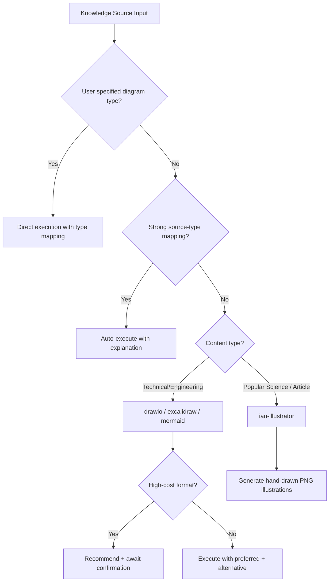

# ai-viz

> **AI-powered visualization methodology & toolkit** — From content to diagrams, AI decides and generates automatically

[](https://www.npmjs.com/package/ai-viz)
[](./LICENSE)
[](./package.json)

[中文文档](./README.zh-CN.md)

---

<p align="center">
  
</p>

**You focus on ideas and architecture decisions. AI handles the visualization.**

ai-viz compiles visualization methodology and format-specific instructions into your AI coding tool's native instruction directory. Once installed, just describe what you want — the AI generates professional diagrams in DrawIO, Excalidraw, or Mermaid format.

## Features

- **Plugin System** — Modular output formats (DrawIO / Excalidraw / Mermaid) with independent instructions and schema
- **Multi-Tool Adapters** — Works with 10 major AI coding tools through native integration points
- **Cross-Format Export** — Export DrawIO diagrams to PNG/SVG/PDF via CLI
- **Design Language** — Project-level color scheme, typography, and layout configuration (`design-language.yaml`)
- **Quality Control** — Built-in rendering specs and self-check methodology
- **Bilingual Support** — Full Chinese/English instruction support

## Why "ai-viz"?

**ai-viz** = **AI** + **Viz**ualization

The name reflects our core philosophy: humans focus on thinking, architecture, and judgment — visualization is delegated to AI. "viz" keeps it short and universal, not limited to engineering diagrams alone but open to any form of visualization — from architecture diagrams to article illustrations — that AI can assist with.

## Dynamic Routing

> ai-viz doesn't just draw diagrams — it intelligently decides **what** to draw based on your content.

<p align="center">
  
</p>

When you describe a visualization need, ai-viz automatically analyzes your content and routes it to the most appropriate diagram type and plugin — no manual selection required.



### Source-to-Diagram Mapping

| Knowledge Source | Recommended Type | Plugin |
|------------------|------------------|--------|
| System/service design docs | Architecture diagram | drawio / excalidraw |
| API specs / call chains | Sequence diagram | mermaid |
| Business rules / requirements | Flowchart | drawio / mermaid |
| Code (classes/interfaces) | Class diagram | mermaid |
| DDL / entity descriptions | ER diagram | drawio |
| State machines | State diagram | mermaid |
| **Popular science articles / blogs** | **Article illustrations** | **ian-illustrator** |
| **Concept explanations / metaphors** | **Concept visuals** | **ian-illustrator** |
| **Methodology / tutorials** | **Content illustrations** | **ian-illustrator** |

## Prerequisites

| Dependency | Required | Purpose |
|-----------|----------|----------|
| [Node.js](https://nodejs.org/) >= 16 | Yes | CLI runtime |
| [Draw.io Desktop](https://github.com/jgraph/drawio-desktop/releases) | Optional | Export drawio diagrams to PNG/SVG (only needed for drawio plugin) |
| AI Coding Tool | Yes | At least one supported tool (see [Supported Tools](#supported-ai-tools)) |

> **Note**: Draw.io Desktop is only required if you use the `drawio` plugin and want to export diagrams to image formats. The CLI will auto-detect your Draw.io installation path.

## Quick Start

```bash
npx ai-viz init
```

The interactive wizard will guide you through:
1. Selecting your AI coding tool
2. Choosing output format plugins
3. Setting language preference
4. Generating design language config

Then just tell your AI: *"Draw an architecture diagram for this project"* — it knows what to do.

## Supported AI Tools

| Tool | Output Location |
|------|----------------|
| Claude Code | `.claude/skills/ai-viz/` |
| Cursor | `.cursor/rules/` |
| Windsurf | `.windsurf/rules/` |
| OpenCode | `.opencode/agents/` |
| GitHub Copilot | `.github/copilot-instructions.md` |
| Codex | `codex.md` |
| Qoder | `skills/ai-viz/` |
| Aider | `.ai-viz/` |
| Trae | `.trae/rules/` |
| CodeBuddy | `.codebuddy/rules/` |

## Plugins

| Plugin | Description | Capabilities |
|--------|-------------|--------------|
| **drawio** | Professional diagrams with Draw.io XML format | Generate, Edit, Export (PNG/SVG/PDF) |
| **excalidraw** | Hand-drawn style diagrams with Excalidraw JSON | Generate, Edit |
| **mermaid** | Text-based diagrams for documentation and README | Generate, Edit |
| **ian-illustrator** | Hand-drawn article illustrations with Xiaohei IP | PNG |

## Commands

```bash
npx ai-viz init              # Interactive setup wizard
npx ai-viz add <plugin>      # Add a plugin (drawio, excalidraw, mermaid)
npx ai-viz remove <plugin>   # Remove a plugin
npx ai-viz export <file>     # Export .drawio to PNG/SVG/PDF
npx ai-viz update            # Re-compile and re-install instructions
```

### Export Options

```bash
npx ai-viz export diagram.drawio              # Default: PNG at 2x scale
npx ai-viz export diagram.drawio -f svg       # Export as SVG
npx ai-viz export diagram.drawio --scale 3    # Custom scale factor
```

## Project Structure

```
ai-viz/
├── bin/cli.js                 # CLI entry point
├── src/
│   ├── index.js               # Command definitions
│   ├── commands/              # init, add, remove, export, update
│   ├── compiler/              # Compiles methodology + plugins for adapters
│   ├── adapters/              # Tool-specific output generators
│   └── utils/                 # Tool detection utilities
├── core/                      # Methodology, routing, quality (en + zh)
├── plugins/
│   ├── drawio/                # Draw.io plugin (instructions + schema + export)
│   ├── excalidraw/            # Excalidraw plugin (instructions + schema)
│   └── mermaid/               # Mermaid plugin (instructions)
├── specs/                     # Rendering specifications by diagram type
│   ├── architecture/          # Layered, microservice diagrams
│   ├── behavior/              # Sequence, flowchart diagrams
│   └── concept/               # Timeline, comparison, convergence
└── templates/                 # Config and design language templates
```

## How It Works

<p align="center">
  
</p>

1. `npx ai-viz init` reads your preferences
2. The **Compiler** assembles core methodology + selected plugins + design language
3. The **Adapter** for your AI tool writes compiled instructions to the tool's native location
4. Your AI coding tool picks up the instructions and gains visualization capabilities

## Documentation

- [Getting Started](./docs/en/getting-started.md)
- [Architecture](./docs/en/architecture.md)
- [Plugin Development](./docs/en/plugin-development.md)

## Author & Community

ai-viz is maintained by **Li Hao**, a 10-year product engineering practitioner and founder of **DeepJAI**, focusing on business architecture, system design, and AI Agent engineering.

For Chinese readers, I also write about system design, AI Coding, architecture thinking, and AI Agent engineering on my WeChat official account:

<p align="center">
  
</p>

Search **程序员李浩** on WeChat to follow.

- For technical discussion, join the free **DeepJAI open community**.
- For systematic learning, follow the in-progress **AI Three-Sword Course**. The course is the foundation of DeepJAI's learning system, and each stage may later evolve into dedicated columns.
- The **DeepJAI member community** provides course materials, professional Q&A, learning feedback, and long-term support.

## Contributing

Contributions are welcome! See the [Plugin Development Guide](./docs/en/plugin-development.md) for creating new output format plugins.

## Credits & Acknowledgments

ai-viz is built upon the methodology and practices from these excellent open-source projects:

| Source Project | Contribution | Author |
|---------------|-------------|--------|
| [drawio-skill](https://github.com/Agents365-ai/drawio-skill) | DrawIO diagram generation methodology and prompt engineering | [Agents365-ai](https://github.com/Agents365-ai) |
| [excalidraw-diagram-skill](https://github.com/coleam00/excalidraw-diagram-skill) | Excalidraw diagram generation workflow and schema reference | [coleam00](https://github.com/coleam00) |
| [ian-xiaohei-illustrations](https://github.com/helloianneo/ian-xiaohei-illustrations) | Article illustration methodology with Xiaohei IP character | [helloianneo](https://github.com/helloianneo) |

ai-viz integrates, extends, and universalizes these skills into a unified plugin architecture with intelligent routing, multi-tool adapter support, and standardized methodology framework.

## License

[MIT](./LICENSE)
