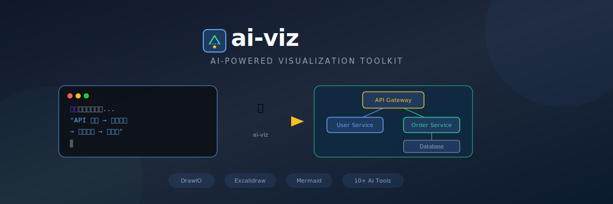
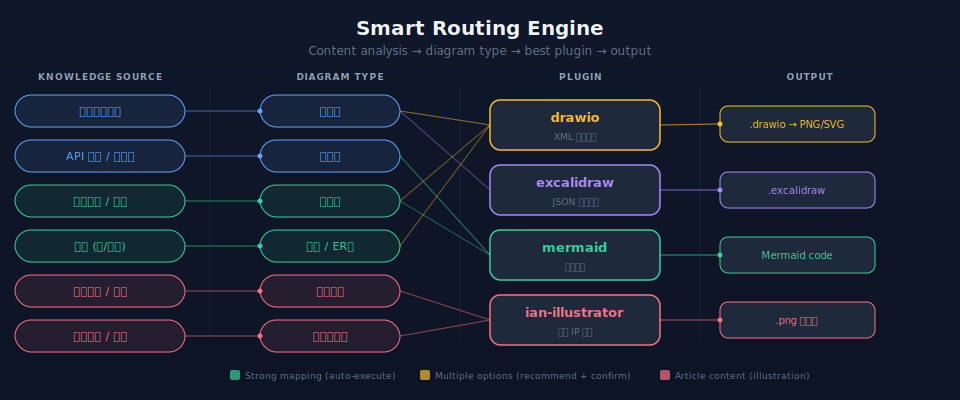
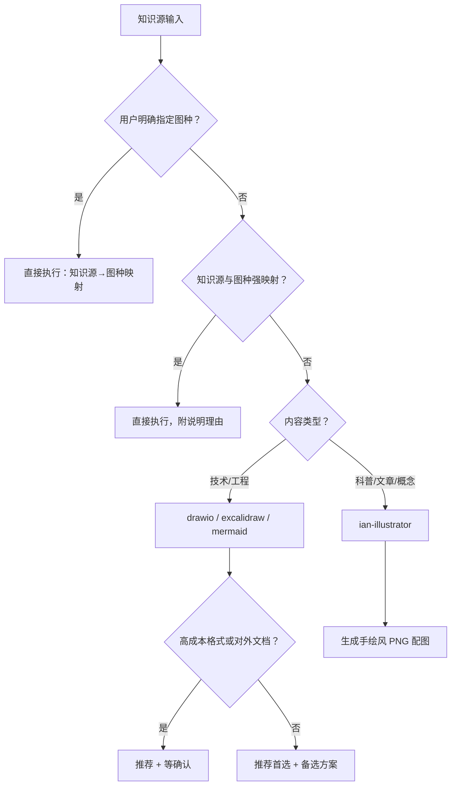
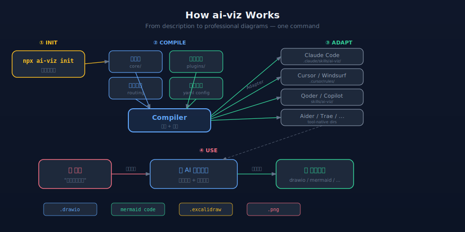

# ai-viz

> **AI 驱动的通用可视化方法论与工具包** — 从内容到图表，AI 智能决策、自动生成

[](https://www.npmjs.com/package/ai-viz)
[](./LICENSE)
[](./package.json)

[English](./README.md) | 中文

---

<p align="center">
  
</p>

**人专注于思想和架构判断，可视化执行交给 AI。**

ai-viz 将可视化方法论和格式指令编译安装到 AI 编程工具的原生指令目录中。安装后，你只需描述需求 — AI 即可生成 DrawIO、Excalidraw 或 Mermaid 格式的专业图表。

## 特性

- **插件系统** — 模块化输出格式（DrawIO / Excalidraw / Mermaid），独立指令和 Schema
- **多工具适配** — 通过原生集成点兼容 10 款主流 AI 编程工具
- **跨格式导出** — CLI 一键导出 DrawIO 图表为 PNG/SVG/PDF
- **设计语言** — 项目级配色、排版和布局配置（`design-language.yaml`）
- **质量控制** — 内置渲染规范和自检机制
- **双语支持** — 完整的中英文指令支持

## 为什么叫 "ai-viz"？

**ai-viz** = **AI** + **Viz**ualization（可视化）

这个名字体现了我们的核心理念：**人专注于思想、架构和判断，可视化执行交给 AI**。"viz" 保持简短通用，不局限于图表（diagram）一种形式，而是面向 AI 能辅助的一切可视化场景——从工程图表到科普配图。

## 智能路由

> ai-viz 不只是画图工具——它能根据你的内容智能判断应该画什么类型的图。

<p align="center">
  
</p>

当你描述可视化需求时，ai-viz 会自动分析内容并路由到最合适的图表类型和插件——无需手动选择。



### 知识源→图种映射表

| 知识源 | 推荐图种 | 插件 |
|--------|----------|------|
| 系统/服务设计文档 | 架构图 | drawio / excalidraw |
| API 规范 / 调用链 | 时序图 | mermaid |
| 业务规则 / 需求文档 | 流程图 | drawio / mermaid |
| 代码（类/接口） | 类图 | mermaid |
| DDL / 实体描述 | ER 图 | drawio |
| 状态机 | 状态图 | mermaid |
| **科普文章 / 博客** | **文章配图** | **ian-illustrator** |
| **概念解释 / 比喻类** | **概念可视化** | **ian-illustrator** |
| **方法论 / 教程** | **内容配图** | **ian-illustrator** |

## 前置依赖

| 依赖 | 是否必需 | 用途 |
|------|---------|------|
| [Node.js](https://nodejs.org/) >= 16 | 必需 | CLI 运行环境 |
| [Draw.io Desktop](https://github.com/jgraph/drawio-desktop/releases) | 可选 | 将 drawio 图表导出为 PNG/SVG（仅 drawio 插件需要） |
| AI 编程工具 | 必需 | 至少安装一个支持的工具（见[支持的工具](#支持的-ai-工具)） |

> **提示**：Draw.io Desktop 仅在使用 `drawio` 插件且需要导出图片时才需要安装。CLI 会自动检测你的 Draw.io 安装路径。

## 30 秒快速开始

```bash
npx ai-viz init
```

交互式向导将引导你：
1. 选择 AI 编程工具
2. 选择输出格式插件
3. 设置语言偏好
4. 生成设计语言配置

然后对 AI 说：*「画一个这个项目的架构图」* — 它已经知道该怎么做。

## 支持的 AI 工具

| 工具 | 输出位置 |
|------|----------|
| Claude Code | `.claude/skills/ai-viz/` |
| Cursor | `.cursor/rules/` |
| Windsurf | `.windsurf/rules/` |
| OpenCode | `.opencode/skills/ai-viz/` |
| GitHub Copilot | `.github/copilot-instructions.md` |
| Codex | `codex.md` |
| Qoder | `skills/ai-viz/` |
| Aider | `.ai-viz/` |
| Trae | `.trae/rules/` |
| CodeBuddy | `.codebuddy/rules/` |

## 插件

| 插件 | 说明 | 能力 |
|------|------|------|
| **drawio** | Draw.io XML 格式专业图表 | 生成、编辑、导出（PNG/SVG/PDF） |
| **excalidraw** | Excalidraw JSON 格式手绘风格图表 | 生成、编辑 |
| **mermaid** | 文本格式图表，适合文档和 README | 生成、编辑 |
| **ian-illustrator** | 小黑 IP 手绘文章配图 | PNG |

## 命令速查

```bash
npx ai-viz init              # 交互式安装向导
npx ai-viz add <plugin>      # 添加插件（drawio, excalidraw, mermaid）
npx ai-viz remove <plugin>   # 移除插件
npx ai-viz export <file>     # 导出 .drawio 为 PNG/SVG/PDF
npx ai-viz update            # 重新编译并安装指令文件
```

### 导出选项

```bash
npx ai-viz export diagram.drawio              # 默认：PNG 2x 缩放
npx ai-viz export diagram.drawio -f svg       # 导出为 SVG
npx ai-viz export diagram.drawio --scale 3    # 自定义缩放倍数
```

## 项目结构

```
ai-viz/
├── bin/cli.js                 # CLI 入口
├── src/
│   ├── index.js               # 命令定义
│   ├── commands/              # init, add, remove, export, update
│   ├── compiler/              # 将方法论+插件编译为适配器可消费的格式
│   ├── adapters/              # 各工具的输出生成器
│   └── utils/                 # 工具检测工具函数
├── core/                      # 方法论、路由、质量控制（中英双语）
├── plugins/
│   ├── drawio/                # Draw.io 插件（指令 + Schema + 导出）
│   ├── excalidraw/            # Excalidraw 插件（指令 + Schema）
│   └── mermaid/               # Mermaid 插件（指令）
├── specs/                     # 按图表类型组织的渲染规范
│   ├── architecture/          # 分层、微服务架构图
│   ├── behavior/              # 时序图、流程图
│   └── concept/               # 时间线、对比矩阵、聚合图
└── templates/                 # 配置和设计语言模板
```

## 工作原理

<p align="center">
  
</p>

1. `npx ai-viz init` 读取你的偏好设置
2. **编译器**组装核心方法论 + 选中的插件 + 设计语言
3. **适配器**将编译后的指令写入 AI 工具的原生目录
4. AI 编程工具读取指令，获得可视化能力

### 为什么是项目级，不是全局？

ai-viz 采用**项目级安装**，而非全局安装。这是刻意的设计选择：

- **设计语言因项目而异** — A 项目用深色主题，B 项目用浅色，全局一份配置无法兼顾
- **插件按需选择** — 后端项目可能只要 mermaid，前端项目可能要 excalidraw，全局强制全装是噪音
- **知识源在项目内** — ai-viz 链接的是项目中的代码、DDL、文档，安装位置应该跟着知识源走
- **版本隔离** — 不同项目可以锁定不同版本的 ai-viz，互不影响

每个项目独立 `npx ai-viz init`，各管各的配置和插件。

## 文档

- [快速开始](./docs/zh/getting-started.md)
- [架构文档](./docs/zh/architecture.md)
- [插件开发指南](./docs/zh/plugin-development.md)
- [从架构图到万物可视化：一套 AI 驱动的通用方法论是怎么诞生的](./docs/zh/from-architecture-diagrams-to-everything-visualized.md)

## 关注作者

如果你对 **AI Coding、系统设计、业务架构、AI Agent 工程化** 感兴趣，欢迎关注我的微信公众号：

<p align="center">
  
</p>

我是李浩，十年互联网产品研发工程师，DeepJAI 品牌创始人。

`ai-viz` 是我在长期 AI 编程、架构表达、工程可视化和 Agent 工作流实践中沉淀出来的一部分。在公众号里，我会持续分享系统设计与 AI 实战干货，包括 AI Coding、Agent 工程化、业务架构和开源项目复盘。

如果你只是想做技术交流，可以加入 **DeepJAI 自由交流群**。

如果你想系统学习 AI Coding、业务架构与 Agent 工程化，可以关注我正在打磨的 **《AI三剑课》**。《AI三剑课》是 DeepJAI 的课程体系底座，后续剑1、剑2、剑3都可能衍生出对应专栏。

**DeepJAI 会员交流群** 会承接课程资料、专业答疑、学习反馈和持续支持。

微信搜索 **程序员李浩** 即可关注。

## 贡献

欢迎贡献！请参阅[插件开发指南](./docs/zh/plugin-development.md)了解如何创建新的输出格式插件。

## 致谢与来源

ai-viz 的方法论和插件设计基于以下优秀开源项目的实践与启发：

| 来源项目 | 贡献内容 | 作者 |
|---------|---------|------|
| [drawio-skill](https://github.com/Agents365-ai/drawio-skill) | DrawIO 图表生成方法论与提示工程 | [Agents365-ai](https://github.com/Agents365-ai) |
| [excalidraw-diagram-skill](https://github.com/coleam00/excalidraw-diagram-skill) | Excalidraw 图表生成工作流与 Schema 参考 | [coleam00](https://github.com/coleam00) |
| [ian-xiaohei-illustrations](https://github.com/helloianneo/ian-xiaohei-illustrations) | 小黑 IP 文章配图方法论与工作流 | [helloianneo](https://github.com/helloianneo) |

ai-viz 将这些独立 Skill 整合、扩展并通用化为统一的插件架构，配合智能路由、多工具适配器和标准化方法论框架，实现了“一次安装，全工具可用”的体验。

## 许可证

[MIT](./LICENSE)
