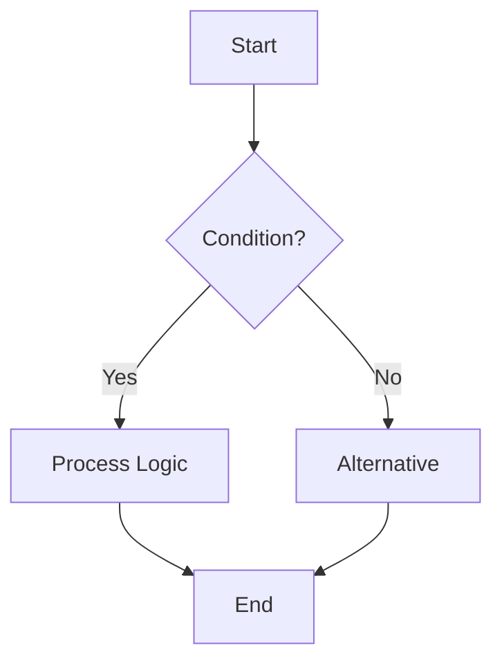
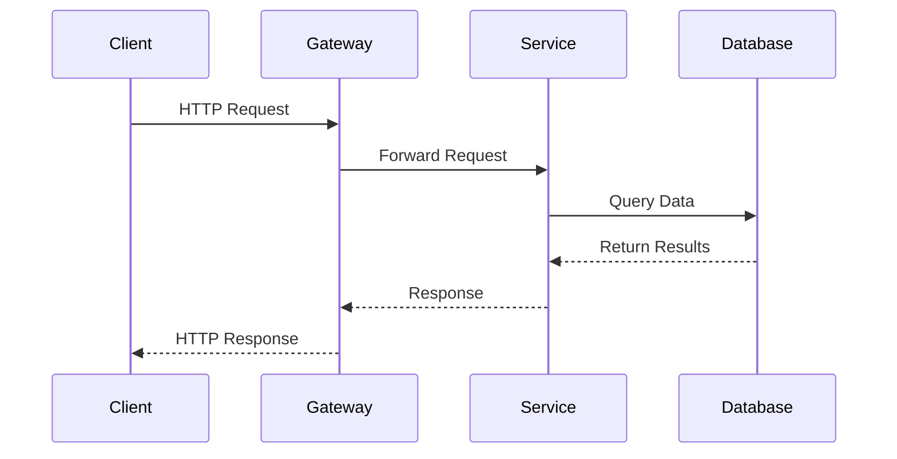
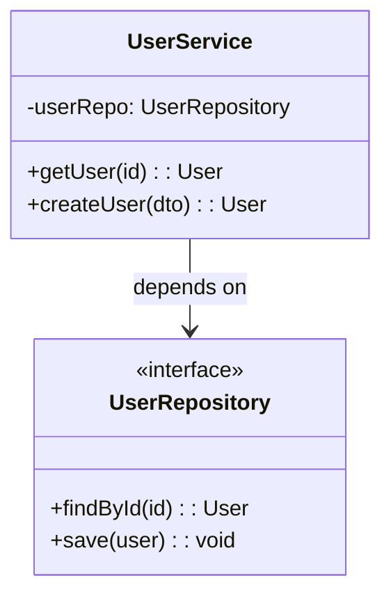
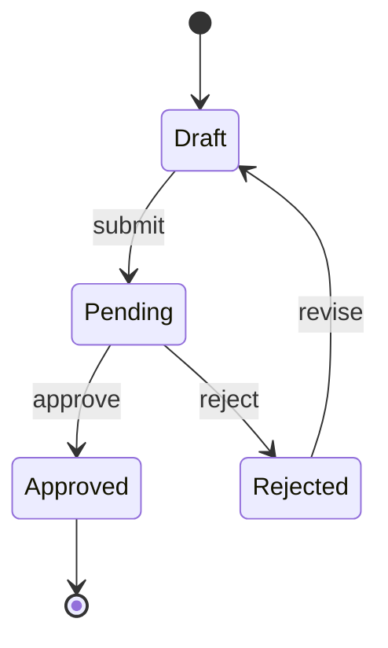
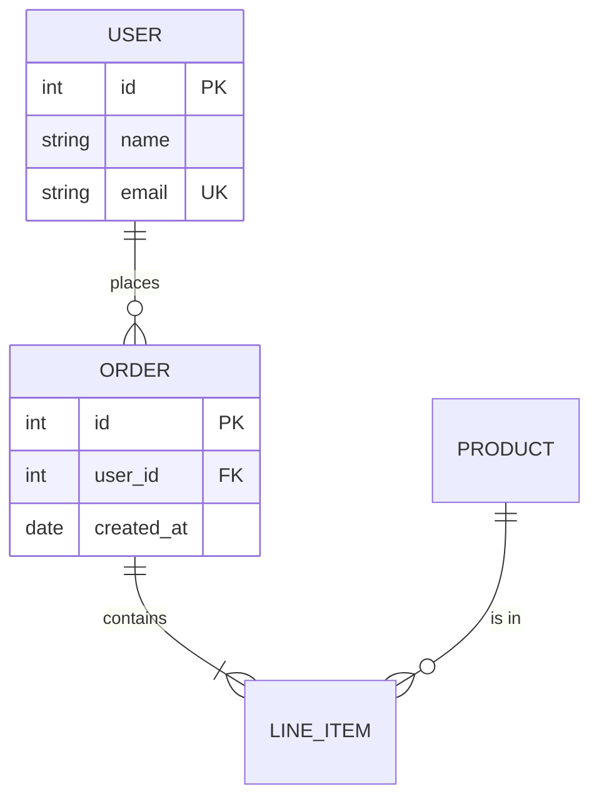
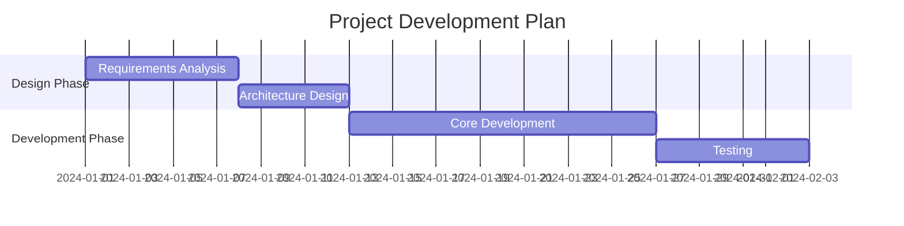
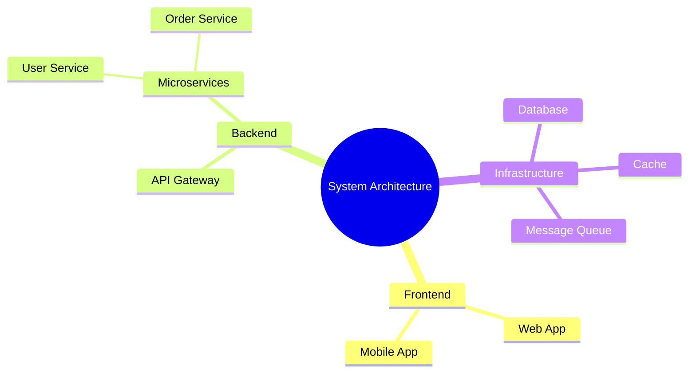
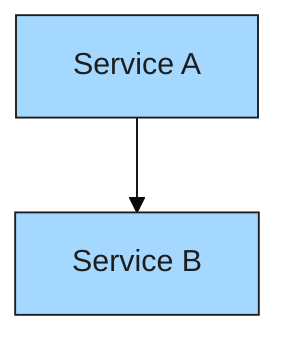

# Mermaid Text Diagram Generation Guide

Generate Mermaid-format text diagrams suitable for embedding in README files, documentation, GitHub Issues, and other Markdown environments.

---

## 1. When to Use Mermaid

### 1.1 Ideal Scenarios

| Scenario | Description |
|----------|-------------|
| README documentation | Project architecture, flow descriptions |
| Git documentation | PR descriptions, issue flow explanations |
| Lightweight needs | Quick sketches, meeting note visualizations |
| Inline display | Diagrams that render directly in Markdown |
| Version control friendly | Pure text, readable git diffs |

### 1.2 When NOT to Use (Recommend Alternatives)

| Scenario | Recommendation |
|----------|---------------|
| Complex diagrams (> 15 nodes) | Excalidraw / Draw.io |
| Precise layout control needed | Excalidraw / Draw.io |
| Hand-drawn aesthetic desired | Excalidraw |
| Custom styling / brand colors | Draw.io / Excalidraw |

---

## 2. Supported Diagram Types

### 2.1 Flowchart

The most common diagram type with direction control.



**Best Practices:**
- Direction: `TD` (top-down), `LR` (left-right) work for most cases
- Semantic node IDs: use English phrases like `auth-check`, `send-email`
- Use `{}` (diamond) for conditional branches
- Keep edge labels short (2-4 words)

**Node Shape Reference:**
```
[Rectangle]    (Rounded)    {Diamond}
([Stadium])    [[Subroutine]]    [(Cylinder/DB)]
((Circle))    >Flag]    {{Hexagon}}
```

### 2.2 Sequence Diagram

Shows interaction timing between participants.



**Best Practices:**
- Use short aliases for participants (`C as Client`)
- Solid arrows `->>` for requests, dashed `-->>` for responses
- Keep message text concise (verb + noun)
- Use `Note over`, `alt/else`, `loop` for semantic enrichment

**Arrow Types:**
```
->>   Solid with arrowhead (sync call)
-->>  Dashed with arrowhead (return)
-)    Solid open arrow (async)
--)   Dashed open arrow (async return)
-x    Solid with cross (failure)
```

### 2.3 Class Diagram

Shows relationships between classes.



**Best Practices:**
- Use `<<interface>>` / `<<abstract>>` annotations
- Visibility: `+` public, `-` private, `#` protected
- Relationships: `-->` dependency, `--|>` inheritance, `..|>` implementation, `--o` aggregation, `--*` composition

### 2.4 State Diagram

Shows state machines and transitions.



**Best Practices:**
- Use `[*]` for start/end states
- Label transitions with verbs
- Use nested `state` for complex states

### 2.5 ER Diagram

Shows data model relationships.



**Best Practices:**
- Relationship symbols: `||` one-to-one, `o{` zero-to-many, `|{` one-to-many
- Mark attributes with `PK` / `FK` / `UK`
- Entity names in UPPERCASE

### 2.6 Gantt Chart

Shows project timelines.



**Best Practices:**
- Use `section` for grouping
- Semantic task IDs
- Support `after` dependencies
- Duration units: `d` (days), `w` (weeks)

### 2.7 Mindmap

Shows hierarchical structures and concept relationships.



**Best Practices:**
- Use indentation for hierarchy
- Root node with `(())` for circle shape
- Keep depth to 3-4 levels
- 3-7 nodes per level

---

## 3. Naming Conventions

### 3.1 Node IDs

| Rule | Example | Rationale |
|------|---------|-----------|
| Semantic English | `auth-service` | Readable |
| kebab-case | `user-login-flow` | Consistent style |
| Avoid pure numbers | ~~`1`, `2`, `3`~~ | No semantics |
| Short and clear | `validate` | Don't over-lengthen |

### 3.2 Label Text

- Node labels: nouns or phrases ("User Service", "API Gateway")
- Edge labels: verbs or phrases ("calls", "returns result", "HTTP GET")
- Maintain consistent language (don't mix languages within one diagram)

---

## 4. Color Scheme

### 4.1 Using Theme Variables

Mermaid injects themes via `%%{init:}%%` directive:



### 4.2 Recommended Theme Configuration

Mapped from `design-language.yaml`:

```
primaryColor: #a5d8ff        (core services)
secondaryColor: #b2f2bb      (external systems)
tertiaryColor: #e9ecef       (infrastructure)
primaryBorderColor: #1e1e1e  (borders)
primaryTextColor: #1e1e1e    (text)
lineColor: #1e1e1e           (connections)
```

### 4.3 Simplicity First

- Most scenarios don't need custom themes — defaults work fine
- Only inject colors for branded or formal documentation
- README diagrams should use default theme for portability

---

## 5. Complexity Control

### 5.1 Node Count Limits

| Node Count | Recommendation |
|------------|---------------|
| <= 8 | Ideal range, clear and readable |
| 9-15 | Acceptable, mind layout direction |
| > 15 | Recommend splitting or switching to Excalidraw/Draw.io |

### 5.2 Simplification Strategies

- **Aggregate**: Merge similar nodes into one ("Microservice Cluster" instead of listing 5 services)
- **Layer**: Use `subgraph` to group related nodes
- **Split**: One overview diagram + multiple detail diagrams
- **Omit**: Describe non-critical paths in comments, don't draw them

### 5.3 Layout Tips

- Flowcharts: use `TD` for few nodes, `LR` for many
- Sequence diagrams: limit to 4-6 participants
- Class diagrams: max 8 classes per diagram
- Use `subgraph` for logical grouping

---

## 6. Quality Checklist

Must verify after generation:

- [ ] Syntax is correct (validate at mermaid.live)
- [ ] Renders without errors
- [ ] Reasonable node count (single diagram <= 15)
- [ ] Semantic node IDs (not A, B, C)
- [ ] Label text is complete (no truncation)
- [ ] Arrow directions correct (data flow is consistent)
- [ ] No orphan nodes (all nodes are connected)
- [ ] Consistent layout direction (don't mix TD and LR)
- [ ] Consistent language in labels

---

## 7. Output Specification

Provide after each generation:

1. Mermaid code block (wrapped in ` ```mermaid `)
2. Summary: diagram type + node count + core logic description
3. Rendering instructions:
   - GitHub/GitLab Markdown native support
   - VS Code Mermaid preview extension
   - https://mermaid.live online editor
4. If complexity exceeded, suggest recommended alternatives

---

## 8. Iteration Protocol

- User feedback → targeted modifications to specific nodes/edges
- Preserve existing structure, only change affected parts
- If complexity grows beyond Mermaid's sweet spot, proactively suggest switching to Excalidraw or Draw.io
