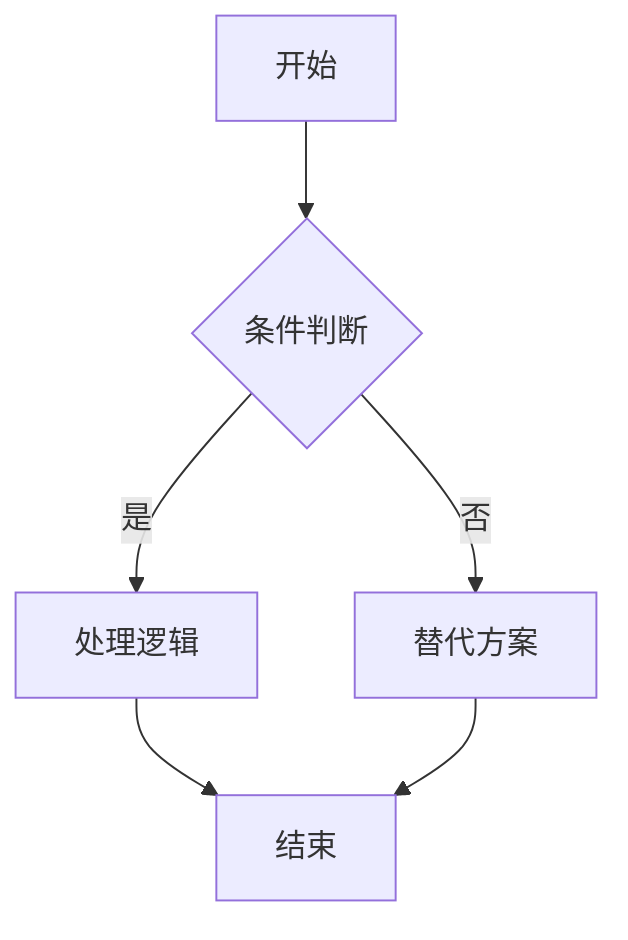
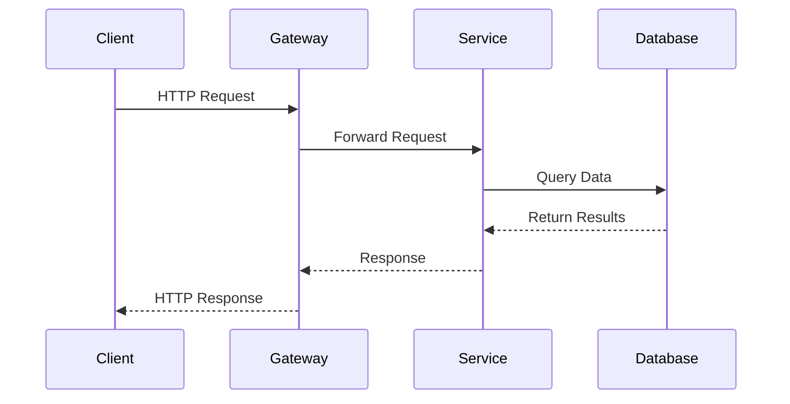
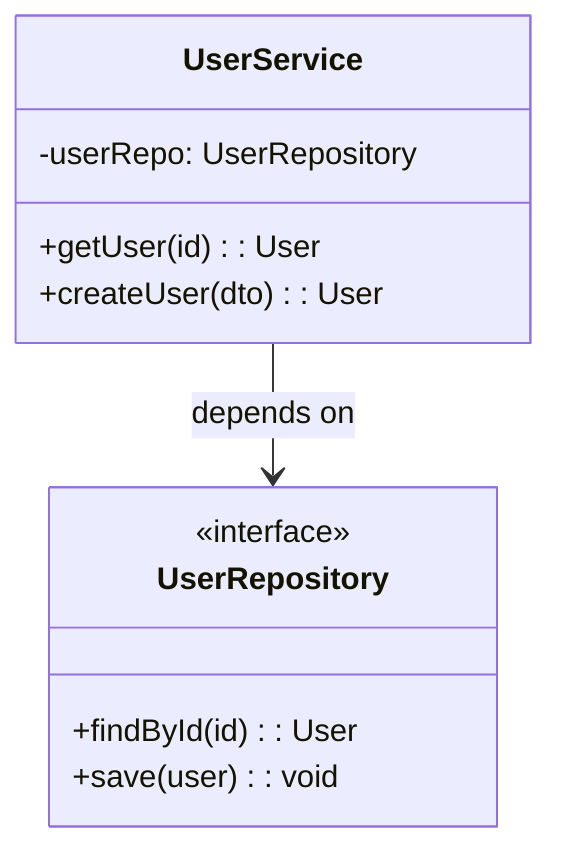
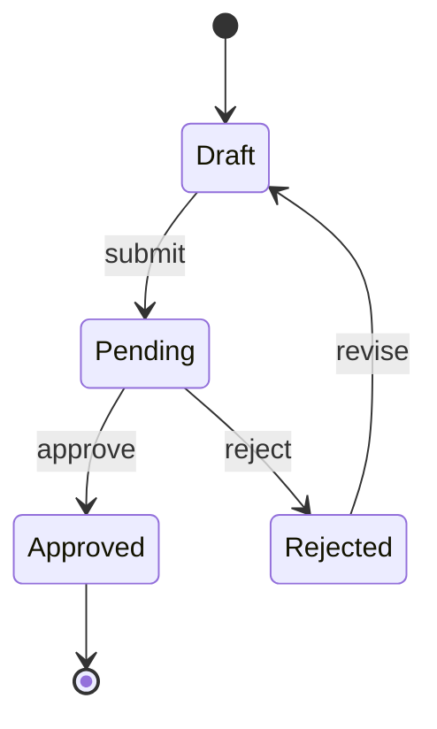
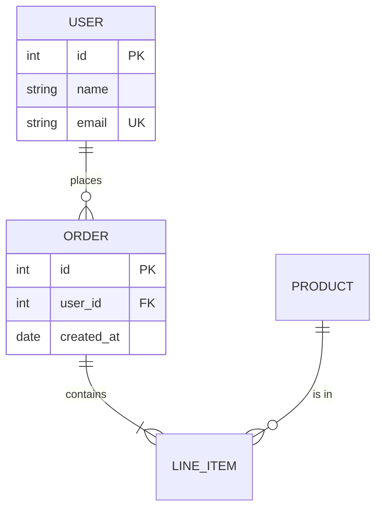
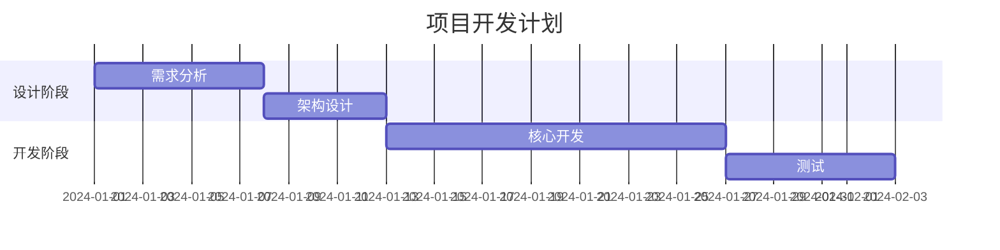
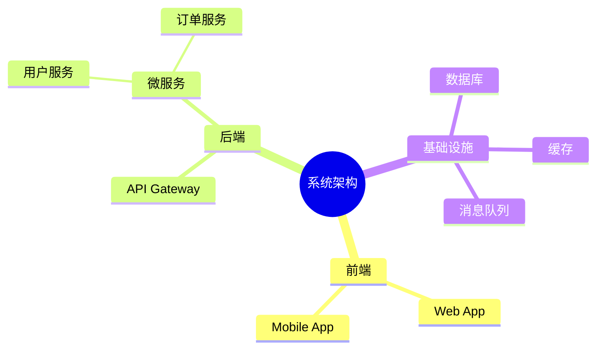
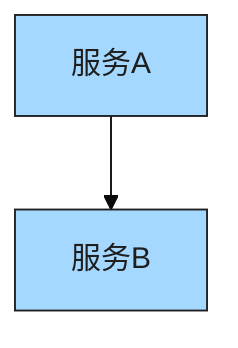

# Mermaid 文本图表生成指南

生成 Mermaid 格式的文本图表，适合嵌入 README、文档、GitHub Issues 等 Markdown 环境。

---

## 一、何时使用 Mermaid

### 1.1 适用场景

| 场景 | 说明 |
|------|------|
| README 文档 | 项目架构说明、流程图 |
| Git 文档 | PR 描述、Issue 流程说明 |
| 轻量级需求 | 快速草图、会议记录可视化 |
| 内联展示 | 需要在 Markdown 中直接渲染的图 |
| 版本管理友好 | 纯文本，git diff 可读 |

### 1.2 不适用场景（推荐其他工具）

| 场景 | 推荐 |
|------|------|
| 复杂架构图（> 15 节点） | Excalidraw / Draw.io |
| 需要精确布局控制 | Excalidraw / Draw.io |
| 需要手绘美感 | Excalidraw |
| 需要自定义样式/品牌色 | Draw.io / Excalidraw |

---

## 二、支持的图种

### 2.1 Flowchart（流程图）

最常用的图种，支持方向控制。



**最佳实践：**
- 方向选择：`TD`（上到下）、`LR`（左到右）适用于大多数场景
- 节点 ID 语义化：用英文短语，如 `auth-check`、`send-email`
- 条件分支用 `{}`（菱形）
- 边标签简短（2-4 字）

**节点形状参考：**
```
[矩形]    (圆角矩形)    {菱形}
([体育场形])    [[子程序]]    [(圆柱/数据库)]
((圆形))    >旗帜形]    {{六边形}}
```

### 2.2 Sequence Diagram（时序图）

展示参与者之间的交互时序。



**最佳实践：**
- participant 用短别名（`C as Client`）
- 实线箭头 `->>` 表示请求，虚线 `-->>` 表示响应
- 消息文字简明（动词+名词）
- 可用 `Note over`、`alt/else`、`loop` 增加语义

**箭头类型：**
```
->>   实线带箭头（同步调用）
-->>  虚线带箭头（返回）
-)    实线开放箭头（异步）
--)   虚线开放箭头（异步返回）
-x    实线带叉（失败）
```

### 2.3 Class Diagram（类图）

展示类之间的关系。



**最佳实践：**
- 用 `<<interface>>` / `<<abstract>>` 标注
- 访问修饰符：`+` public, `-` private, `#` protected
- 关系类型：`-->` 依赖, `--|>` 继承, `..|>` 实现, `--o` 聚合, `--*` 组合

### 2.4 State Diagram（状态图）

展示状态机和状态转换。



**最佳实践：**
- 用 `[*]` 表示开始/结束状态
- 转换标签用动词
- 复杂状态用嵌套 `state`

### 2.5 ER Diagram（实体关系图）

展示数据模型关系。



**最佳实践：**
- 关系符号：`||` 一对一, `o{` 零到多, `|{` 一到多
- 属性标注 `PK` / `FK` / `UK`
- 实体名大写

### 2.6 Gantt Chart（甘特图）

展示项目时间线。



**最佳实践：**
- 用 `section` 分组
- 任务 ID 语义化
- 支持 `after` 依赖关系
- 时间单位：`d`（天）、`w`（周）

### 2.7 Mindmap（思维导图）

展示层级结构和概念关系。



**最佳实践：**
- 用缩进表示层级
- 根节点用 `(())` 圆形
- 保持 3-4 层深度
- 每层 3-7 个节点

---

## 三、命名规范

### 3.1 节点 ID

| 规则 | 示例 | 说明 |
|------|------|------|
| 语义化英文 | `auth-service` | 可读性好 |
| kebab-case | `user-login-flow` | 统一风格 |
| 避免纯数字 | ~~`1`, `2`, `3`~~ | 无语义 |
| 简短明确 | `validate` | 不要过长 |

### 3.2 标签文字

- 节点标签：名词或短语（"用户服务"、"API Gateway"）
- 边标签：动词或短语（"调用"、"返回结果"、"HTTP GET"）
- 保持中英文一致，不要混用

---

## 四、配色方案

### 4.1 使用主题变量

Mermaid 通过 `%%{init:}%%` 指令注入主题：



### 4.2 推荐主题配置

基于 `design-language.yaml` 映射：

```
primaryColor: #a5d8ff        (核心服务)
secondaryColor: #b2f2bb      (外部系统)
tertiaryColor: #e9ecef       (基础设施)
primaryBorderColor: #1e1e1e  (边框)
primaryTextColor: #1e1e1e    (文字)
lineColor: #1e1e1e           (连线)
```

### 4.3 简洁优先

- 多数场景无需自定义主题，默认主题即可
- 仅在品牌展示或正式文档中注入配色
- README 图表建议用默认主题保持通用性

---

## 五、复杂度控制

### 5.1 节点数限制

| 节点数 | 建议 |
|--------|------|
| <= 8 | 理想范围，清晰可读 |
| 9-15 | 可接受，注意布局方向 |
| > 15 | 建议拆分或换用 Excalidraw/Draw.io |

### 5.2 简化策略

- **聚合**：将同类节点合并为一个（"微服务集群"代替列举 5 个服务）
- **分层**：用 subgraph 将相关节点分组
- **拆分**：一张总览图 + 多张细节图
- **省略**：非核心路径用注释说明，不画出

### 5.3 布局建议

- 流程图：节点少用 `TD`，节点多用 `LR`
- 时序图：参与者控制在 4-6 个
- 类图：单图不超过 8 个类
- 使用 `subgraph` 逻辑分组

---

## 六、质量自检

生成后必须检查：

- [ ] 语法正确（可在 mermaid.live 验证）
- [ ] 可正常渲染（无语法错误）
- [ ] 节点数合理（单图 <= 15）
- [ ] 节点 ID 语义化（非 A, B, C）
- [ ] 标签文字完整（无截断）
- [ ] 箭头方向正确（数据流向一致）
- [ ] 无孤立节点（所有节点有连接）
- [ ] 布局方向统一（不混合 TD 和 LR）
- [ ] 中英文标签一致（不混用）

---

## 七、输出规范

每次生成后提供：

1. Mermaid 代码块（用 ` ```mermaid ` 包裹）
2. 摘要：图种 + 节点数 + 核心逻辑说明
3. 渲染方式说明：
   - GitHub/GitLab Markdown 原生支持
   - VS Code Mermaid 预览插件
   - https://mermaid.live 在线编辑器
4. 如超出复杂度建议，说明推荐的替代方案

---

## 八、迭代协议

- 用户反馈修改需求 → 定向修改对应节点/连线
- 保留已有结构，只改变更部分
- 如复杂度增长超出 Mermaid 适用范围，主动建议切换到 Excalidraw 或 Draw.io
